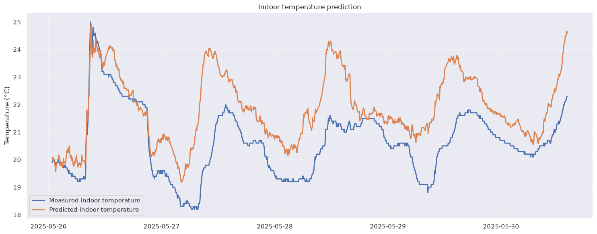

# ThermalTwin

[](...)
[](...)
[](...)
[](...)
[](...)

Object-oriented framework for indoor temperature prediction using Netatmo weather station data. Therefore, a grey-box digital twin for apartment thermal modelling, temperature prediction, and future climate control is implemented.

## Motivation

Most home climate systems use fixed rules, don't consider thermal behaviour of the system.

ThermalTwin investigates whether an apartment can learn its own behaviour and make better climate decisions using predictions.

## Overview

ThermalTwin explores how an apartment can learn its own thermal behaviour using sensor data.

The project combines:
- physical thermal modelling
- machine learning
- system identification

to predict indoor temperature and eventually control the indoor climate.

The long-term goal is to use **Model Predictive Control (MPC)** to optimize actions such as ventilation, heating, or cooling.

## Concept

A simplified view:


```text
Outside conditions
        |
        v
+------------------+
|  Thermal model   |
| + ML correction  |
+------------------+
        |
        v
Indoor temperature prediction
        |
        v
MPC controller
        |
        v
Climate control
```


## Current inputs

Initially:

- Indoor temperature
- Indoor humidity
- Outdoor temperature
- Outdoor humidty
- Time information

Future inputs:
- CO₂ / occupancy estimation
- Window state
- Solar radiation
- Ventilation state

## Planned features

- [x] Data collection and exploration
- [x] Temperature forecasting
- [x] Thermal parameter estimation (2R2C model)
- [x] Grey-box apartment model
- [x] Hidden state estimation
- [ ] Model Predictive Control (MPC)
- [ ] Smart ventilation control

## Technology

Built with:

- TBD

## Environment Setup

This project uses a dedicated Conda environment to keep dependencies isolated from the system Python installation.

### Create the environment

Run:

```bash
./setup_env.sh
```

This will:

- Create the `weather_nn` Conda environment
- Install all required packages
- Register the environment as a Jupyter kernel


### Start Jupyter Notebook

Run:

```bash
./start_jupyter.sh
```

This automatically activates the correct environment and starts Jupyter Notebook.


### Manual activation

If needed, the environment can also be activated manually:

```bash
conda activate weather_nn
```


### Updating dependencies

After adding or changing packages, update the environment:

```bash
conda env update -f environment.yml
```


To save the current working environment:

```bash
conda env export > environment_locked.yml
```

### First Results
- For 5-minute ahead prediction, the previous indoor temperature was already an extremely strong predictor due to the building's thermal inertia. 
- A simple persistence model (predicting the next temperature as the current temperature) achieved the best performance, outperforming both regression models and the neural network. This indicates that short-term indoor temperature dynamics are dominated by the current indoor state rather than by external weather conditions.

<p align="center">
  
</p>

- Currently working on the OO part, extracting models from notebooks
